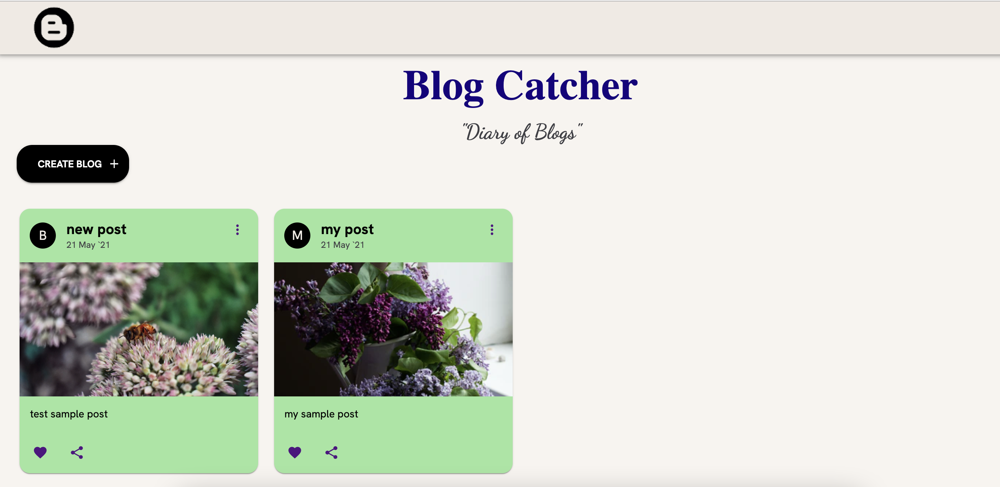
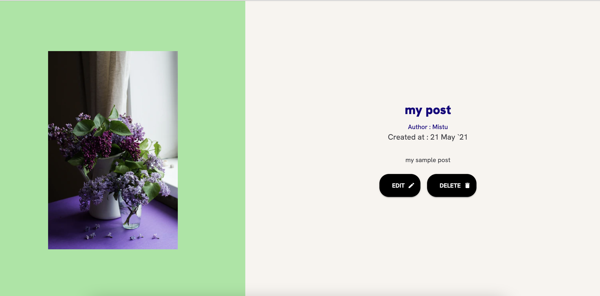

# Blog-Catcher
It is a Mern Blogging Website.

# Quick Start 🚀
### Install the required libraries
### For Backend 💻
```bash
cd Blog-backend
```
```bash
npm i
node index.js
```
### For Frontend 💻
```bash
cd Blog-frontend
```
```bash
npm i
npm start
```

### Hurrah!! Blog Catcher is running successfully in your localhost.

### Home Page


### Deatils Page


### Edit Page


Feel free to share your thoughts and contribute in this project. You can email me at sm2244@it.jgec.ac.in. My linkedIn profile : https://www.linkedin.com/in/sharmistha-mandal-636744194/


### Author & Created by - Sharmistha Mandal.

